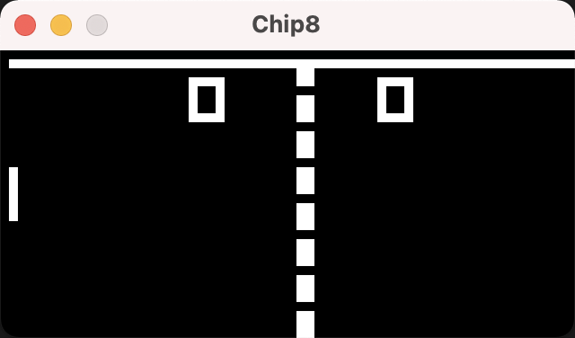
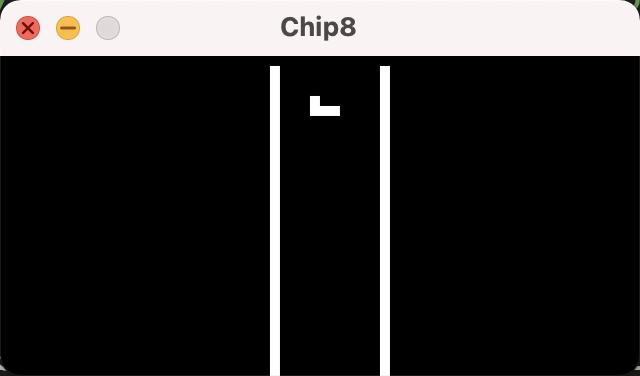
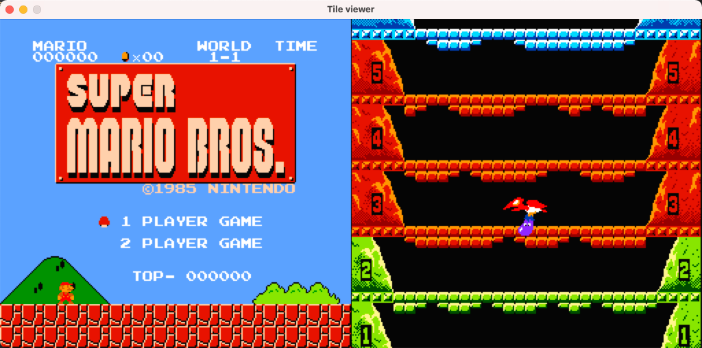

## [WIP]learn emulator

### go-chip8
``` shell
go run main.go
```



#### source
* https://en.wikipedia.org/wiki/CHIP-8
* http://devernay.free.fr/hacks/chip8/C8TECH10.HTM
* https://github.com/skatiyar/go-chip8

### rust-nes
```shell
cargo run
```



#### source
* http://wiki.nesdev.com/w/index.php/Nesdev_Wiki
* https://bugzmanov.github.io/nes_ebook/
